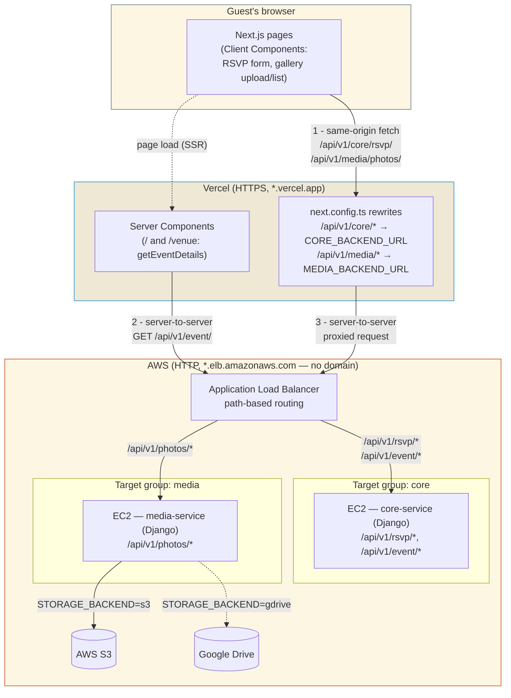

# Architecture — High-Level Design

How the wedding site is deployed and how a request actually travels through
it. See [`README.md`](./README.md) for what each service does; this doc is
about how they're wired together and hosted.

## Deployment topology

- **Frontend** — Next.js app on **Vercel**, served from a free
  `*.vercel.app` subdomain (or a custom domain later, if added). No change
  needed to add one later — Vercel handles that independently of everything
  below.
- **Backends** — two Django services (`core-service`, `media-service`), each
  running on its own **EC2 target group** behind a single **AWS Application
  Load Balancer (ALB)**. The ALB has one DNS name (AWS-provided, free,
  `*.elb.amazonaws.com`) and uses **path-based routing** to send
  `/api/v1/rsvp/*` and `/api/v1/event/*` to the `core-service` target group,
  and `/api/v1/photos/*` to the `media-service` target group.
- **No domain purchase required.** Both the Vercel subdomain and the ALB's
  AWS-assigned DNS name are free. The tradeoff: ACM can't issue a TLS
  certificate for `*.elb.amazonaws.com` (cert validation needs a domain you
  control), so the ALB stays **HTTP-only** unless a real domain is added
  later.

## Why the request doesn't go browser → ALB directly

The frontend is served over **HTTPS** (Vercel). The ALB, with no domain, can
only serve **HTTP**. A browser calling an HTTP API from an HTTPS page hits
**mixed-content blocking**, and it would also be a genuine **cross-origin**
request (different host = CORS), needing preflight and CORS headers on the
Django side.

Both problems disappear if the browser never talks to the ALB directly.
Instead, the browser calls **its own origin** (`*.vercel.app`), and
Next.js — running server-side, on Vercel's infrastructure — makes the actual
HTTP call to the ALB. Server-to-server HTTP calls aren't subject to browser
mixed-content or CORS rules at all.

This is implemented with `next.config.ts`
[`rewrites()`](https://nextjs.org/docs/app/api-reference/config/next-config-js/rewrites#rewriting-to-an-external-url),
which transparently proxies matching paths to an external URL:

```ts
// frontend/next.config.ts
rewrites: [
  { source: "/api/v1/core/:path*",  destination: `${CORE_BACKEND_URL}/api/v1/:path*` },
  { source: "/api/v1/media/:path*", destination: `${MEDIA_BACKEND_URL}/api/v1/:path*` },
]
```

`CORE_BACKEND_URL` / `MEDIA_BACKEND_URL` are both set to the **same ALB DNS
name** in production (path-based routing on the ALB does the actual
core-vs-media split); see `frontend/.env.local.example` for the full
production-value example.

## Two request paths, by component type

Not every request goes through the proxy — only the ones a **browser**
initiates. Server Components render on Vercel's server and can call the ALB
directly with no CORS/mixed-content concern in the first place (no browser
involved yet).

| Caller | Example | Path |
|---|---|---|
| Server Component | `app/page.tsx`, `app/venue/page.tsx` → `getEventDetails()` | Vercel server → ALB directly |
| Client Component | RSVP form, photo upload/gallery | Browser → `/api/v1/core\|media/*` (same origin) → Vercel rewrite → ALB |

## Diagram



## Why path-based routing on one ALB (not two ALBs, not two domains)

- One ALB → one DNS name → both `CORE_BACKEND_URL` and `MEDIA_BACKEND_URL`
  can point at the same host in production; the ALB's listener rules decide
  which target group actually serves a given path.
- Avoids paying for/managing a second load balancer for a site this size.
- If a service ever needs to scale or fail independently in a way path
  routing can't express, splitting to two ALBs (or two listener ports on one
  ALB) is a config change on the AWS side only — nothing in the Next.js
  proxy or Django services needs to change, since they already treat
  `CORE_BACKEND_URL`/`MEDIA_BACKEND_URL` as independent values.

## What would change if a real domain gets added later

- ACM can then issue a real certificate for the ALB, so it can serve HTTPS.
- At that point the browser-mixed-content problem goes away even for direct
  calls, but the proxy setup described here still works unchanged and stays
  the simpler, single-origin option — removing it would be optional, not
  required.
